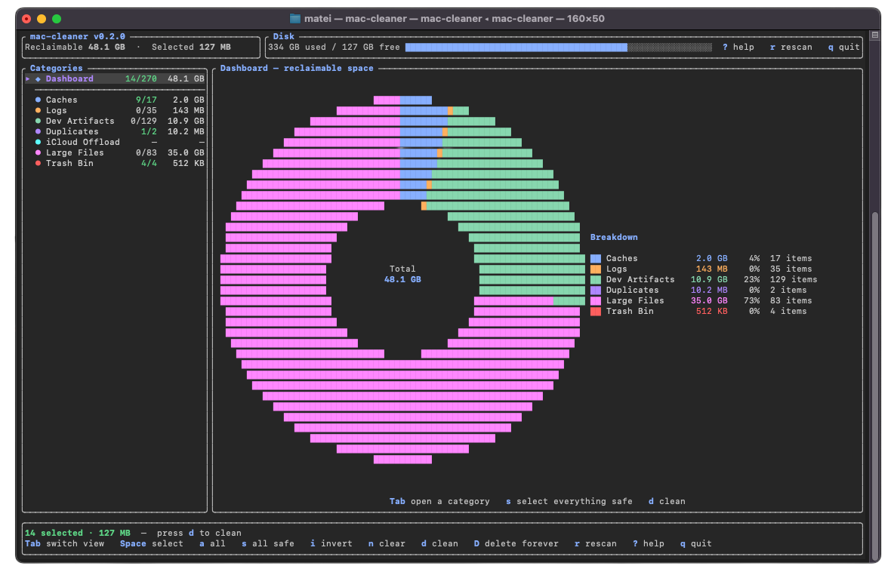

# mac-cleaner

[](https://www.rust-lang.org/)
[](https://www.apple.com/macos/)
[](#license)



Data-driven macOS cleanup, with a fast terminal UI and a simple rule: **review the evidence before deleting anything**.

mac-cleaner finds redundant files by measuring real disk usage, hashing duplicates, grouping reclaimable space by category, and showing exactly what will be cleaned. No mystery buttons. No blind "optimize" switch. Just the data you need to reclaim space with confidence.

## Why mac-cleaner?

Most cleaners ask you to trust them. mac-cleaner shows its work.

- **See the space first**: dashboard totals update from the scan results and refresh after cleaning.
- **Clean what is actually redundant**: duplicates are hash-verified, caches/logs are matched by known signatures, and iCloud files are evicted instead of deleted.
- **Stay in control**: every item is visible, selectable, and color-coded before anything happens.
- **Recover by default**: normal cleanup moves files to Trash unless you explicitly choose permanent delete.
- **Built for macOS details**: sparse files, Trash behavior, Full Disk Access, iCloud offload, and protected app data are handled deliberately.

## What It Finds

| Category | What mac-cleaner looks for |
| --- | --- |
| **Caches** | Recursive cache signatures such as `Cache`, `Code Cache`, `GPUCache`, `*ShipIt`, developer caches, and Docker prune targets |
| **Logs** | `logs` / `log` directories and `*.log` files across your home folder |
| **Duplicates** | Same-size files verified with partial hashing and full `blake3` hashing |
| **iCloud** | Large local iCloud Drive copies that can be evicted while keeping the file in iCloud |
| **Large Files** | Big files in common user folders: Downloads, Documents, Desktop, Movies |
| **Trash** | Trash size and permanent emptying when you choose to clean it |

## Safety Model

mac-cleaner is built to be cautious by default.

- **Review-first TUI**: nothing is cleaned until you confirm it.
- **Trash by default**: use Finder's Put Back when you want to undo.
- **Permanent delete is explicit**: press `D`, not `d`.
- **Duplicate keepers are locked**: the oldest copy is kept unless you choose another keeper.
- **Protected paths are skipped**: browser profiles, keychains, SSH/GPG data, Photos Library, Steam, and other sensitive folders are avoided.
- **Real disk size is used**: sparse files are measured by allocated blocks, not misleading logical size.

## Install

Install from GitHub:

```bash
cargo install --git https://github.com/mat50013/mac-cleaner.git
```

Or run from source:

```bash
git clone https://github.com/mat50013/mac-cleaner.git
cd mac-cleaner
cargo run --release
```

## Quick Start

Launch the TUI:

```bash
mac-cleaner
```

Scan, review the dashboard, open a category, select what you want, then clean.

| Key | Action |
| --- | --- |
| `Tab` / `Shift+Tab` | Cycle Dashboard and categories |
| `↑` / `↓` or `j` / `k` | Move selection |
| `Space` | Toggle selected item |
| `a` / `A` | Select all / deselect category |
| `s` | Select all safe items |
| `n` | Clear all selections |
| `i` | Invert category selection |
| `Enter` | Duplicates: choose which copy to keep |
| `d` | Move selected items to Trash |
| `D` | Delete selected items forever |
| `r` | Rescan |
| `?` | Help |
| `q` / `Esc` | Quit |

## CLI

Use mac-cleaner headlessly when you want scriptable output or cleanup.

```bash
# Scan and print results
mac-cleaner scan

# JSON output
mac-cleaner scan --json

# Scan specific categories
mac-cleaner scan --categories caches,logs,duplicates

# Clean safe items without opening the TUI
mac-cleaner clean --categories caches --yes

# Preview actions without deleting anything
mac-cleaner --dry-run

# Write the default config
mac-cleaner init-config
```

## Permissions

mac-cleaner requests administrator privileges by default so it can scan system-level caches and other users' data. Your password is entered in the terminal through `sudo`.

Skip elevation when you only want user-folder cleanup:

```bash
mac-cleaner --no-elevate
```

Full Disk Access is separate from `sudo`. macOS may require it for Mail, Safari, TCC-protected locations, and some application data. If access is limited, mac-cleaner opens the correct System Settings pane from the TUI.

## Configuration

Create a default config:

```bash
mac-cleaner init-config
```

Then edit `~/.config/mac-cleaner/config.toml`.

```toml
[cache]
roots = ["~/Library/Caches", "~/Library/Application Support"]

[logs]
age_days = 7

[large]
min_bytes = 104857600  # 100 MB

[privilege]
auto_elevate = true

[delete]
mode = "trash"  # or "permanent"
```

## How It Works

1. **Parallel scanning** walks configured roots with the `ignore` crate and `rayon`.
2. **Real-size accounting** uses allocated blocks, so sparse files are not overcounted.
3. **Duplicate detection** buckets by size, checks partial hashes, then verifies full-file `blake3` hashes.
4. **Risk scoring** combines size, safety tier, and staleness to rank high-value cleanup first.
5. **Background workers** keep scanning and cleaning off the UI thread, so the TUI stays responsive.

## Status

mac-cleaner is already useful for local cleanup, but it is intentionally conservative. Review the scan results, use Trash mode first, and run `--dry-run` when testing new config roots.

## License

MIT
