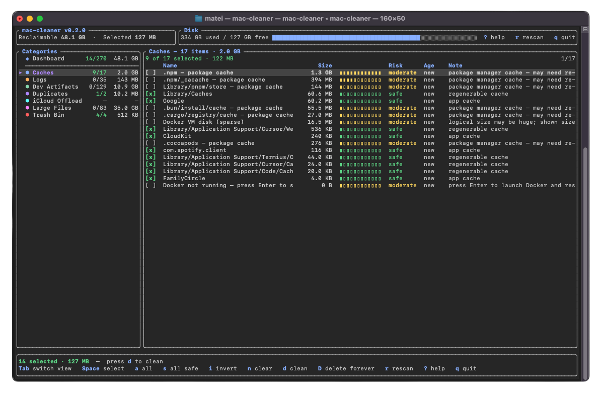

# mac-cleaner

A terminal UI that finds the disk space macOS quietly wastes — caches, build artifacts, dependency folders, logs, duplicate downloads — and helps you take it back.

Everything it targets is regenerable: data your machine can recreate, re-download, or rebuild on demand. That kind of data is useless to keep, takes real space, and is scattered across so many tool-specific folders that nobody finds it by hand. mac-cleaner does the finding; you review and decide.


## Why this exists

The space that disappears on a Mac usually isn't documents or photos. It's what tools leave behind and never clean up:

- `~/Library/Caches` grows without bound — browsers, package managers, and every Electron app keep their own private stash there.
- Every project you ever built still carries its `target`, `node_modules`, `.venv`, or `build` folder, often gigabytes each.
- Xcode keeps DerivedData, device support files, and old simulators long after you need them.
- The same installer sits in Downloads twice because the second download got a ` (1)` suffix.
- Logs rotate but never get deleted.

None of this is precious. Delete a cache and the app rebuilds it; delete `node_modules` and `npm install` restores it. The hard part was never deciding — it's knowing where all of it lives. mac-cleaner scans those places in parallel, measures real on-disk usage, and puts everything in one reviewable list.

## What it finds

| Category | Contents |
| --- | --- |
| Caches | Cache directories matched by signature (`Cache`, `Code Cache`, `GPUCache`, …), package manager caches (Homebrew, pip, npm, cargo, …), Docker prune targets |
| Logs | `*.log` files and log folders across your home directory |
| Dev Artifacts | Generated project output (`target`, `build`, `dist`, `.next`, `.terraform`) and dependency folders (`node_modules`, `.venv`), plus Xcode DerivedData and simulator data |
| Duplicates | Byte-identical files, confirmed by hash — the oldest copy is kept |
| iCloud Offload | Large local iCloud Drive copies that can be evicted (freed locally, kept in iCloud) |
| Large Files | Big files in common user folders, and stale installers/archives in Downloads |
| Trash Bin | What's already in the Trash, ready to be emptied |

## How it decides what's safe

Every item gets a risk tier, and the tier controls the default:

- **safe** — regenerable at no cost (caches, old logs). Selected automatically.
- **moderate** — regenerable at a price: deleting `node_modules` means reinstalling, deleting DerivedData means a rebuild. Never auto-selected; shown for review.
- **risky** — user data the tool can't vouch for (large files, duplicate keepers). Never auto-selected.

A few more rules back that up:

- Deleting moves files to the Trash. Permanent deletion is a separate key (`D`) with its own confirmation.
- In a duplicate set, one copy is always locked as the keeper. You can move the lock, but you can't delete every copy.
- Protected paths — browser profiles, keychains, SSH/GPG keys, the Photos library — are skipped entirely, no matter what they contain.
- Sizes come from allocated disk blocks, so sparse files like `Docker.raw` are counted at their real size, not their apparent one.

## Install

With [Rust](https://rustup.rs/) installed:

```bash
cargo install --git https://github.com/mat50013/mac-cleaner.git
```

The binary lands in `~/.cargo/bin`. If `mac-cleaner` isn't found afterwards, that directory is missing from your `PATH`:

```bash
echo 'export PATH="$HOME/.cargo/bin:$PATH"' >> ~/.zshrc && exec zsh
```

Or run it straight from a clone, no `PATH` setup needed:

```bash
git clone https://github.com/mat50013/mac-cleaner.git
cd mac-cleaner
cargo run --release
```

## Using it

Start `mac-cleaner` and it scans immediately. The dashboard shows where the space is; `Tab` opens each category as a table you can work through:



| Key | Action |
| --- | --- |
| `Tab` / `Shift+Tab` | Next / previous view — the dashboard comes first |
| `↑` `↓` or `j` `k` | Move between rows |
| `Space` | Toggle the highlighted item |
| `a` / `A` | Select / deselect everything in the category |
| `s` | Select every safe item, across all categories |
| `i` / `n` | Invert the category / clear all selections |
| `Enter` | In Duplicates: choose which copy to keep |
| `d` | Move selected items to the Trash |
| `D` | Delete selected items permanently |
| `r` | Rescan |
| `?` | Help |
| `q` | Quit |

A typical session: press `s` to grab everything safe, `Tab` through Dev Artifacts and Duplicates to add what you recognize, `d` to clean, then `r` and empty the Trash Bin category.

### Scripting

The same scanners run headless:

```bash
mac-cleaner scan                          # summary table
mac-cleaner scan --json                   # machine-readable
mac-cleaner scan --categories caches,dev  # limit the scan
mac-cleaner clean --categories caches --yes
mac-cleaner --dry-run                     # preview, delete nothing
```

Category slugs: `caches`, `logs`, `dev`, `duplicates`, `icloud`, `large`, `trash`.

### Permissions

At launch, mac-cleaner asks for administrator rights via `sudo` so it can size system-level caches. Skip that with `--no-elevate` to clean only your own files. Full Disk Access is a separate macOS permission; if it's missing, the app detects it and offers to open the right System Settings pane.

## Configuration

Optional. Generate a starting point with:

```bash
mac-cleaner init-config   # writes ~/.config/mac-cleaner/config.toml
```

Anything you leave out keeps its default:

```toml
delete_mode = "trash"     # or "permanent"

[cache]
roots = ["~/Library/Caches", "~/Library/Application Support"]

[logs]
age_days = 7              # older than this counts as safe

[large]
min_bytes = 104857600     # 100 MB threshold for Large Files
stale_archive_min_bytes = 26214400
stale_archive_days = 30

[dev_artifacts]
roots = ["~/Documents", "~/Downloads", "~/Desktop"]
artifact_dir_names = ["target", "build", "dist", ".next", ".terraform"]
dependency_dir_names = ["node_modules", ".venv", "venv"]

[duplicates]
min_bytes = 1048576       # ignore files under 1 MB when hashing

[privilege]
auto_elevate = true
```

## How the scan works

Categories scan in parallel on a bounded thread pool sized from your CPU count, so a full scan takes seconds without saturating the machine. Directory walks use the `ignore` crate; duplicate detection buckets files by size, screens them with a partial hash, and confirms with a full `blake3` hash before anything is called a duplicate. Scanning and cleaning both run off the UI thread and stream progress back, so the interface never blocks.

## Development

```bash
cargo build
cargo test              # unit + integration tests
cargo test -- --ignored # also the tests that touch the real Trash
cargo fmt && cargo clippy
```

Test layout and conventions are documented in `TESTING.md`.

The README screenshots are rendered from the actual UI:

```bash
cargo run --example ui_svg
rsvg-convert -o assets/dashboard.png assets/dashboard.svg
rsvg-convert -o assets/detail.png assets/detail.svg
```

## Troubleshooting

**`command not found` after install** — `~/.cargo/bin` isn't on your `PATH`; see [Install](#install).

**"The file … is locked. (-45)"** — the file has macOS's locked flag set. Clear it with `chflags nouchg "/path/to/file"` (or untick Locked in Finder's Get Info), then clean again.

**"Operation not permitted" when deleting** — some files resist being moved to the Trash while running as root. Use permanent delete (`D`), or relaunch with `--no-elevate`.

## License

MIT
